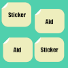

# StickerAid
This tool is to create main.png and tab.png for LINE stickers and programmed with Microsoft Small Basic programming language.

## Release

## Required Environment
- Windows Vista, 7, 8, 10, 11
- .NET 3.5 Framework

## Usage
1. Download programs above and run StickerAid.exe.
2. Open a zip file which contains LINE sticker PNG files.
3. Drag and drop stikcers for main.png and tab.png.
4. Save them to the opened zip file.

TIPS: It's easy to draw LINE stickers with MagicalDraw written by Kukusama.

## Links
- [LINE Creators Market](https://creator.line.me/en/)
- [MagicalDraw](https://draw.kuku.lu/)
- [Microsoft Small Basic](http://smallbasic.com)
- [LitDev Extension](http://litdev.co.uk/)